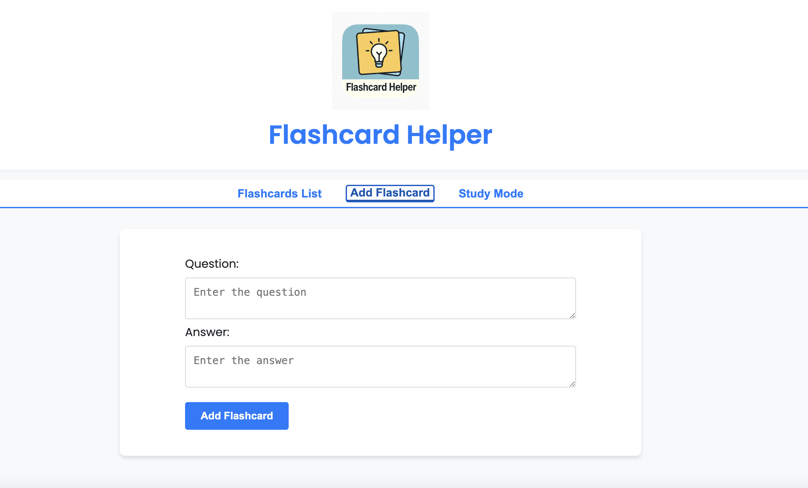
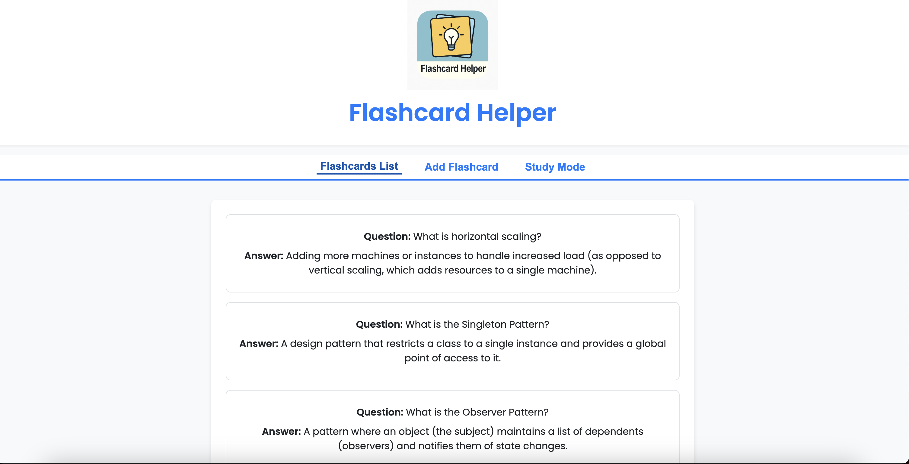
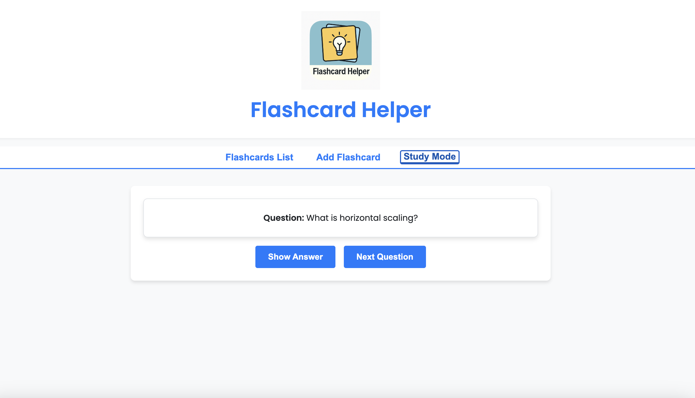
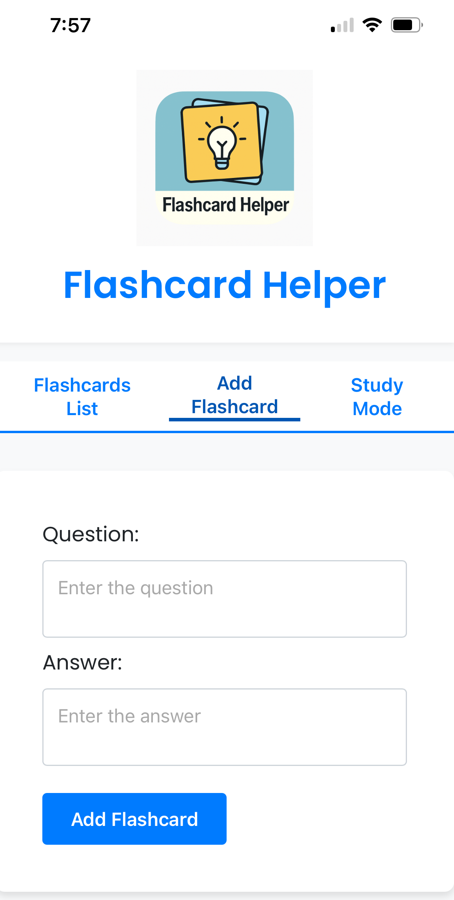
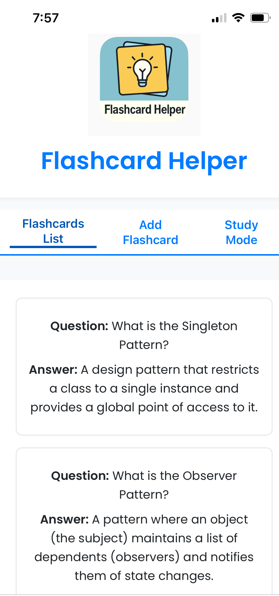
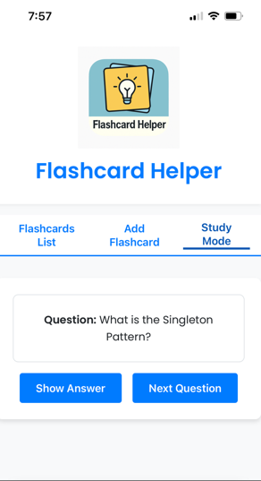

# Flashcard Helper

Flashcard Helper is a Progressive Web App (PWA) designed to help students create, manage, and study flashcards. The app provides an interface for adding flashcards, viewing them in a list, and studying them in a study mode.

## Data Storage and Offline Availability
Flashcard Helper uses the browser’s local storage or device's storage to save your flashcards. When you install the app on your mobile device as a Progressive Web App (PWA), your flashcards aren’t stored in a cloud or shared database - instead, they’re saved locally within your device’s storage. This means:

- Local Data: All your flashcards remain on the device or browser where you created them.
- Offline Access: Since the data is stored locally, you can access and study your flashcards even without an internet connection.
- Device-Specific Storage: The flashcards won’t sync across devices automatically. If you clear your browser data or uninstall the app, your flashcards will be lost unless you back them up manually.

## Features

- **Flashcard Management**: Add, view, and manage flashcards with ease.
- **Study Mode**: Study flashcards interactively with options to reveal answers and navigate through questions.
- **Local Storage**: Flashcards are saved in the browser's local storage.
- **Responsive Design**: Optimized for both desktop and mobile devices.
- **PWA Support**: Installable as a Progressive Web App for offline use.

## Installation

- Clone the repository
- Minimum node version required is `node v18`
- Install dependencies `npm ci`
- Start the development server `npm run dev`
- Make sure your mobile device and development machine are connected to the same Wi-Fi network.
- In your mobile device, go to `YOUR_MACHINE_IP_ADDRESS:5173`. This should load the app. Select 'add to home screen` to install this app.

## Screenshots

App running in a mobile device

