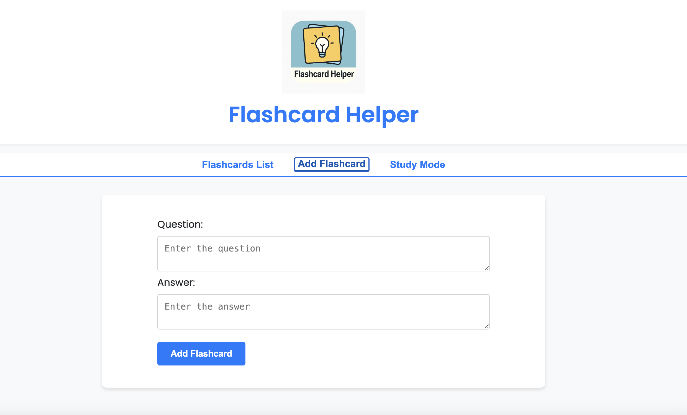
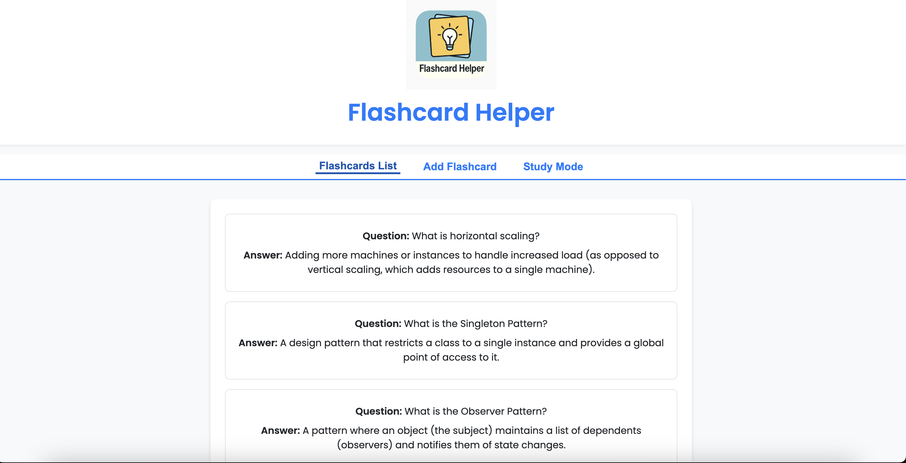
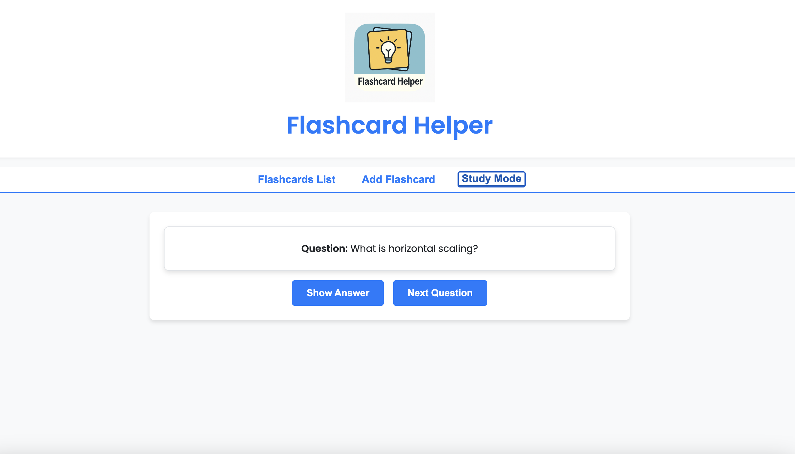
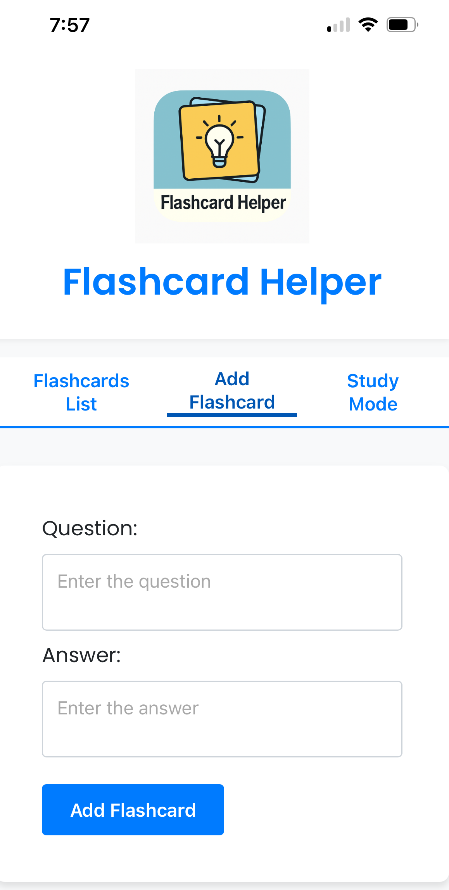
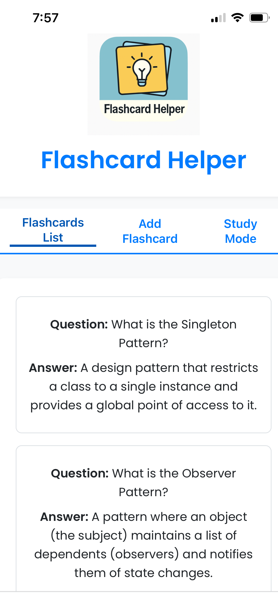
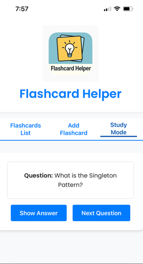

# Flashcard Helper

Flashcard Helper is a Progressive Web App (PWA) designed to help students create, manage, and study flashcards. The app provides an interface for adding flashcards, viewing them in a list, and studying them in a study mode.

## Data Storage and Offline Availability
Flashcard Helper uses the browser’s local storage or device's storage to save your flashcards. When you install the app on your mobile device as a Progressive Web App (PWA), your flashcards aren’t stored in a cloud or shared database - instead, they’re saved locally within your device’s storage. This means:

- Local Data: All your flashcards remain on the device or browser where you created them.
- Offline Access: Since the data is stored locally, you can access and study your flashcards even without an internet connection.
- Device-Specific Storage: The flashcards won’t sync across devices automatically. If you clear your browser data or uninstall the app, your flashcards will be lost unless you download a backup from Settings first.

## Features

- **Spaced repetition**: Rate each card Again, Hard, Good or Easy and the app schedules it to come back right before you'd forget it. The home screen shows how many cards are due today.
- **Decks**: Organize cards into color-coded decks, each with its own progress bar, search, and review or practice sessions.
- **Study mode**: Cards flip in 3D like real index cards. Swipe right if you knew it, left if you didn't, or use the keyboard (Space to flip, 1 to 4 to rate, Esc to exit). Every session ends with a summary.
- **Practice mode**: Shuffle through a whole deck any time without changing its schedule.
- **Three ways to add cards**: Write one card at a time, paste a list (`question | answer` per line), or turn a PDF of your notes into cards with Gemini or Claude.
- **Streaks and progress**: Daily streak, a 7-day activity chart, and a mastered count.
- **Backup and restore**: Download all your decks as a JSON file and import them on another device.
- **Light and dark themes**: Follows your system, or pick one in Settings.
- **PWA support**: Installable and works offline.

Cards saved by earlier versions of the app are migrated automatically into a deck called "My cards".

## Keyboard shortcuts (study mode)

| Key | Action |
| --- | --- |
| Space / Enter | Flip card |
| 1, 2, 3, 4 | Again, Hard, Good, Easy (practice mode: 1 still learning, 2 got it) |
| Esc | End session |

## Installation

- Clone the repository
- Minimum node version required is `node v18`
- Install dependencies `npm ci`
- Start the development server `npm run dev`
- Make sure your mobile device and development machine are connected to the same Wi-Fi network.
- In your mobile device, go to `YOUR_MACHINE_IP_ADDRESS:5173`. This should load the app. Select 'add to home screen` to install this app.

## Screenshots

App running in a mobile device

